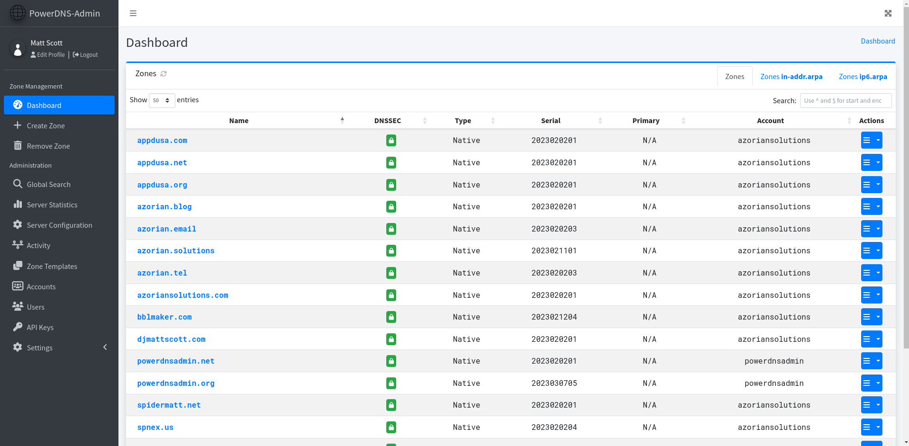

# Dockerize PowerDNS

AIO DNS Server container with web ui management interface 

Check https://hub.docker.com/r/bosdaring/pdns-admin

#### Features:

- lightweight alpine based image
- latest available PowerDNS version on alpinelinux 
- Web Management feature check https://github.com/PowerDNS-Admin/PowerDNS-Admin/

## Running Container
generate 'secret_key' and 'api_key' with command 'openssl rand -base64 32'
#### Docker run

To run the application using the latest stable release on Docker Hub, run the following command:

```
$ docker run -d \
    -e SECRET_KEY='changeme' \
    -v ./pdns:/data \
    -p 8080:80 \
    bosdaring/pdns-admin:latest
```

#### Docker-compose

1. Update the configuration   
   Edit the [docker-compose.yml](https://github.com/bosdaring/pdnsadmin-docker/blob/mail/docker-compose.yml) file to meet your requirements

2. Start docker container
   ```
   $ docker-compose up
   ```

You can then access PowerDNS-Admin by pointing your browser to http://localhost:8080.

## Screenshots



## License

This project is released under the MIT license. For additional
information, [see the full license](https://github.com/PowerDNS-Admin/PowerDNS-Admin/blob/master/LICENSE).
